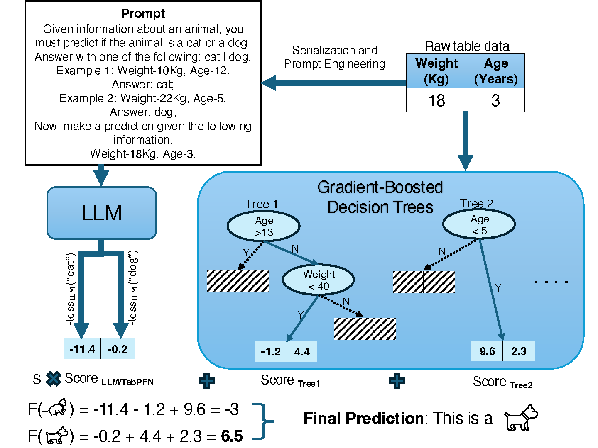

<p align="center">

</p>

# LLM Boost: LLMs Boost the Performance of Decision Trees on Tabular Data across Sample Sizes

This repository is built on top of the Tablet code-base. The original README found here https://github.com/dylan-slack/Tablet contains useful information for installation and LLM inference. 

## Installation
Please follow the instructions in the Installation section of the original README (https://github.com/dylan-slack/Tablet) to create a conda environment and install Tablet.
Next install addional dependencies to your environment ,

```shell
pip install -r requirements.txt
```

## LLM Inference
Use the following to infer and store LLM scores which uses hugggingface to download the specified LLM. See the data folder for the prepared datasets for language model inference. You can use the instructions in the original Tablet README to create new datasets in this format. The repo currently works and is tested with the following families of LLMs: Flan-T5, Llama-3, Qwen-2.5 
```shell
python llm_infer.py --seed 0 --k_shot 3 --name Adult --model google/flan-t5-base
```
This code will save new train and test csv files with LLM scores for each row to ./data/dataset_model_n-shot_seed (In this case ./data/Adult_flan-t5-base_3-shot_0)
full list of dataset inference commands are given in launch_llm_infer.sh

## LLM-Boost Experiments
After Generating LLM Scores use the following to run our boosting experiments. This will run standard XGBoost (With Hyperparamater Tuning) and Additional LLM-Boost Hyperparameter tuning.
```shell
python xgb_llm.py --seed 0 --data_path ./data/Adult_flan-t5-base_3-shot_0 --train_size 20 --cv_folds 40
```
A sample list of training commands for all datasets are given in launch_xgb_llm.sh

## PFN-Boost Experiments
For our PFN-Boost experiments use the following.
```shell
python xgb_tabpfn.py --seed 0 --data_path ./data/Adult/prototypes-naturallanguage-performance-0 --train_size 20 --cv_folds 40
```
A sample list of training commands for all datasets are given in launch_xgb_tabpfn.sh

## LLM+LGBM Experiments
Simillar to the above if using the following,,
```shell
python lgbm_llm.py --seed 0 --data_path ./data/Adult_flan-t5-base_3-shot_0 --train_size 20 --cv_folds 40
```
A sample list of training commands for all datasets are given in launch_lgbm_llm.sh
